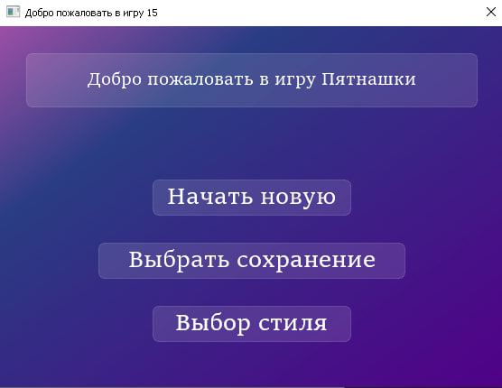
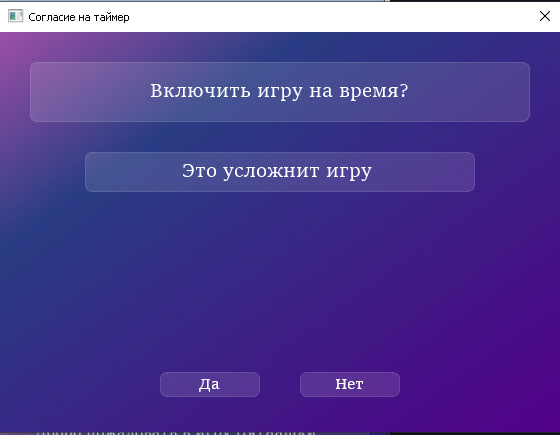
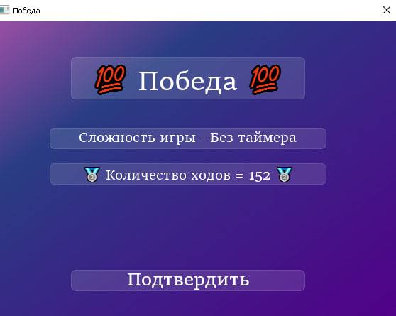
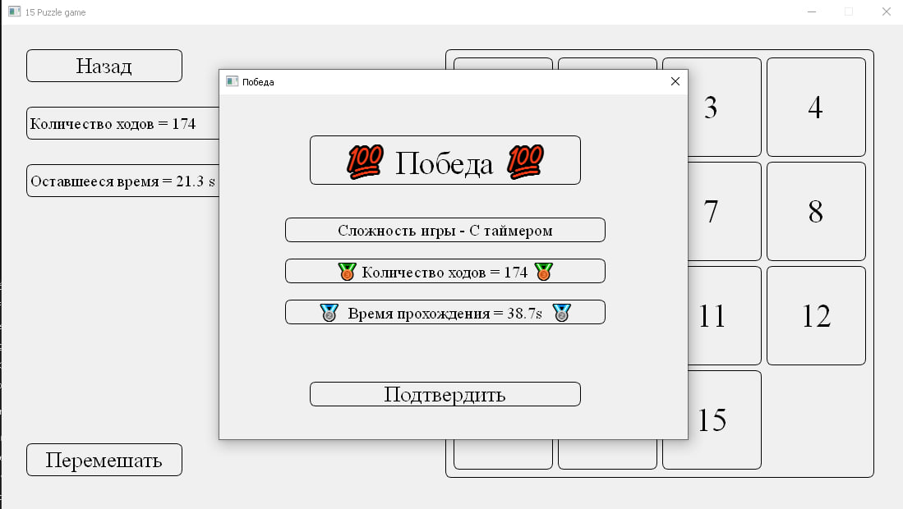
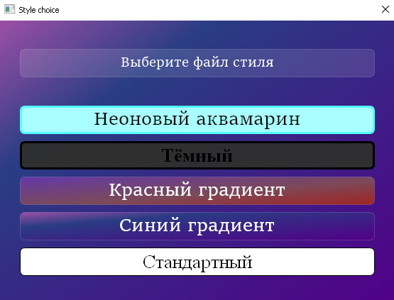

# 🎮 Пятнашки (15 Puzzle)

Классическая игра "Пятнашки"
Игра реализована на python c применением qss

---

##  Возможности

-  **Режим с таймером** — соревнуйся с собой и ставь рекорды
-  **Режим без времени** — спокойно решай головоломку в своём темпе
-  **Выбор интерфейса** — разные стили оформления
-  **Награды за скорость** — после прохождения:
  - 🥇 Золото — за супербыстрое прохождение
  - 🥈 Серебро — чуть медленнее
  - 🥉 Бронза — тоже отлично!
-  **Возможность сохранения** — сохраняй текущее расположение в файл в игре без таймера и считывай его когда хочешь восстановить
---

# Внешний вид :

- Главное меню  
  

- Выбор таймера
  
  
- Победа
  

- Победа с таймером 
  

- Выбор стиля интерфейса  
  
